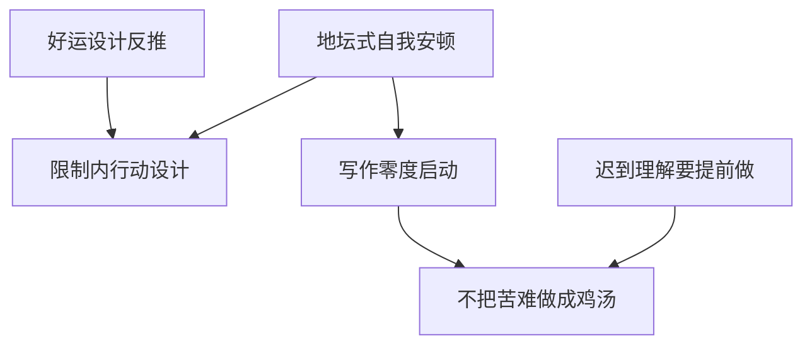

# 《我与地坛》仓颉 skill 索引

## 来源

- 作者: 史铁生
- 源文本来自用户放入的 EPUB, 已抽取到 `source/book.txt`。
- 产出: 6 个可独立调用的 Codex skill。

## Skill 清单

| skill | 中文名 | 适用场景 |
|---|---|---|
| `ditan-self-anchoring` | 地坛式自我安顿 | 用户状态混乱、低落、卡住，想先把自己安放下来时使用：通过稳定场所或低干扰例行承载情绪，再整理问题。急性心理危机或自伤风险不适用，应优先安全支持。 |
| `suffering-without-chicken-soup` | 不把苦难做成鸡汤 | 用户要写作、表达或安慰他人面对苦难时使用：先承认痛苦的不可替代性，再给轻量行动；不把苦难包装成必然成长。 |
| `belated-empathy-forward` | 迟到理解要提前做 | 用户想修复父母、亲密关系或重要关系，理解沉默付出、避免事后后悔时使用；不用于掩盖伤害、控制或安全风险。 |
| `limit-bound-action` | 限制内行动设计 | 用户面对不可改变的身体、家庭、资源或时间限制，需要把问题从抱怨转为本周可做行动时使用；不用于否认限制或制造虚假乐观。 |
| `writing-zero-start` | 写作零度启动 | 用户想写作但没有技巧或题材，或想把绕不开的困惑转成文章时使用：从场景、问题和追问启动，而非追求文采。 |
| `luck-design-reflection` | 好运设计反推 | 用户在幻想理想人生、职业选择或项目方案时使用：反推隐藏代价和缺陷，检验这个幸运是否真的可承受。 |

## 调用关系

## 使用边界

- 这些 skill 来自整书方法论蒸馏, 适合用于决策、写作、管理和自我整理场景。
- 它们不是原书摘要, 也不替代阅读原书。
- 当用户只是想查事实、考据版本或要原文出处时, 应先回到源文本或可靠资料。
